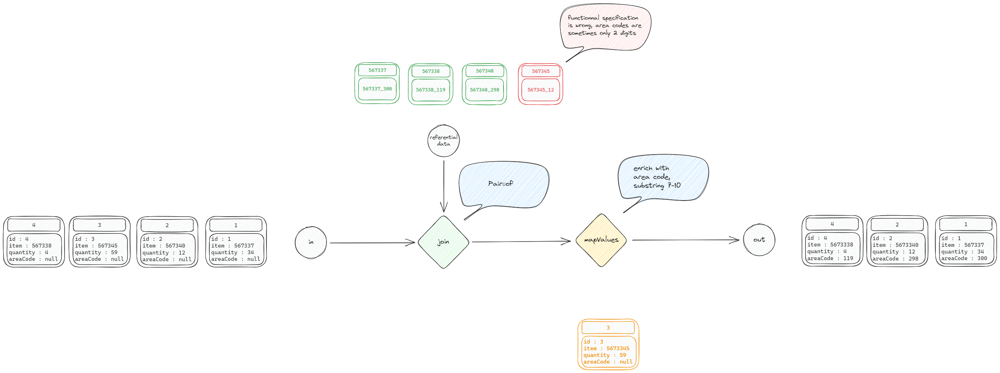

# kstreamplify-demo

This project contains a demo for the kstreamplify library. It aims at getting a comparison between standard kafka streams and the same project with kstreamplify

## Micro topology

# Commands

kafka-topics --create --bootstrap-server kafka-service:9092 --topic bdxio.INPUT_DATA --replication-factor 1 --partitions 3

kafka-topics --create --bootstrap-server kafka-service:9092 --topic bdxio.OUTPUT_ENRICH --replication-factor 1 --partitions 3

kafka-topics --create --bootstrap-server kafka-service:9092 --topic bdxio.REFERENTIAL_DATA --replication-factor 1 --partitions 3

kubectl port-forward svc/akhq-service 8090:8080
